# HW2
1. Project title
    * Shell Program in C
2. Project Description
    * Implementation of a simple shell with support for pipes, background processes, IO redirection, performing internal commands, and executing processes
3. Author
    * John Stephenson
4. Acknowledgment
    * The switch statement in the ownCmdHandler function found at https://www.geeksforgeeks.org/making-linux-shell-c/ was used as a template for implementing the internalCommands function. I probably would have used a series of if statements otherwise.
    * pipe3.c was used for most of the pipe functionality
    * popen.c was used in finding the process name for the jobs command
5. Getting Started
    * Prerequisites/dependencies
        * stdio.h, unistd.h, string.h, stdlib.h, sys/wait.h, fcntl.h
    * Instructions for building the software
        * gcc blazersh.c -o blazersh
        * run the program by executing ./blazersh if blazersh is not in PATH, blazersh otherwise
6. Running the test
    * How to run test cases
        * typing 'help' will bring up the list of internal commands that can be run
        * run other programs within the blazersh shell by typing ./programname or just programname if already in the PATH
        * perform IO redirection for input and output files by typing ./programname < inputfilename.txt > outputfilename.txt
        * execute processes in the background by adding an '&' symbol to the end of the command
        * pipe two or three programs with prog1 (args) | proc2 (args) | prog3 (args)
            * this also works with IO redirection   
        * predefined system programs be executed just like they would in the OS shell, for example typing 'man ls', ps', etc will invoke those programs from the blazersh shell
    * Sample test cases
        * executing processes in the background and the jobs command display
        * pipes for two and three processes and pipes with IO redirection
        * sample output file for pipes with IO redirection
        * changing directories, printing the working directory, listing files in the current directory
        * the help function display
        * setting and listing environment variables
        * when no input or invalid input is executed
        * performing system functions
        * running another program from within the blazersh shell
        * sample input file
        * sample output file
        * quitting the program
7. Screenshots/Sample Session
    * executing processes in the background and the jobs command display
        * 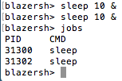   
    * pipes for two and three processes and IO redirection
        * 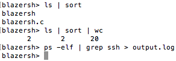 
    * sample output file for pipes with IO redirection
        * 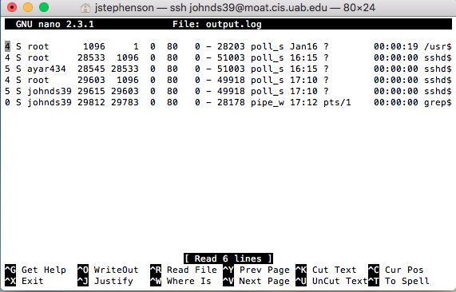
    * changing directories, printing the working directory, listing files in the current directory
        * 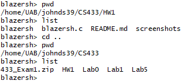
    * the help function display
        * 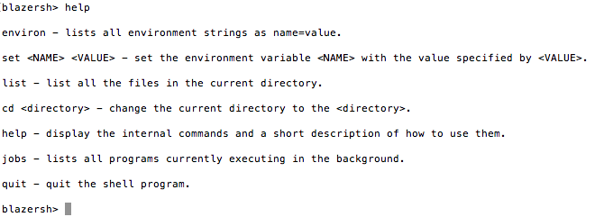
    * setting and listing environment variables
        * 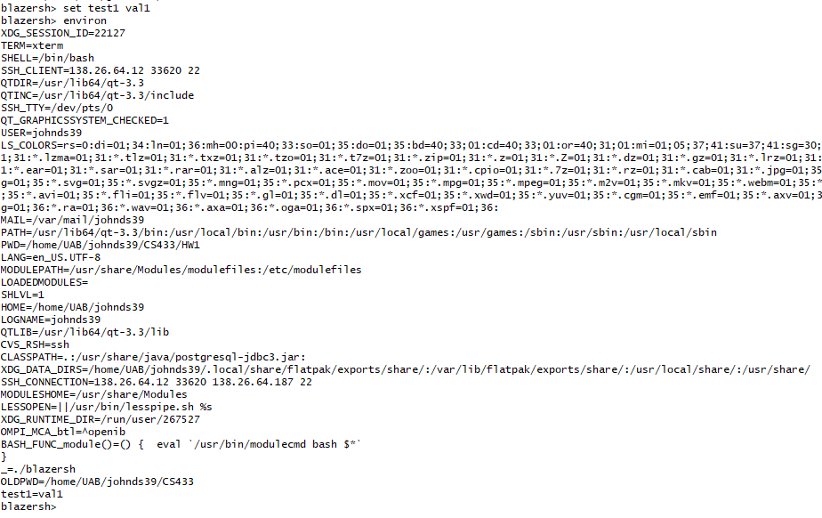 
    * when no input or invalid input is executed
        * 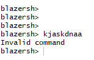
    * performing system functions
        * 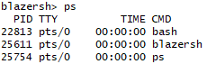
    * running another program from within the blazersh shell
        * 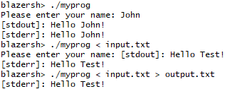
    * sample input file
        * 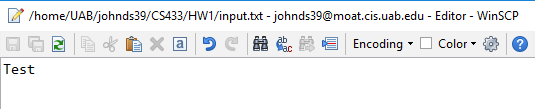
    * sample output file
        * 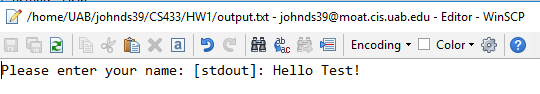
    * quitting the program
        * 
8. Contact Information
    * johnds39@uab.edu